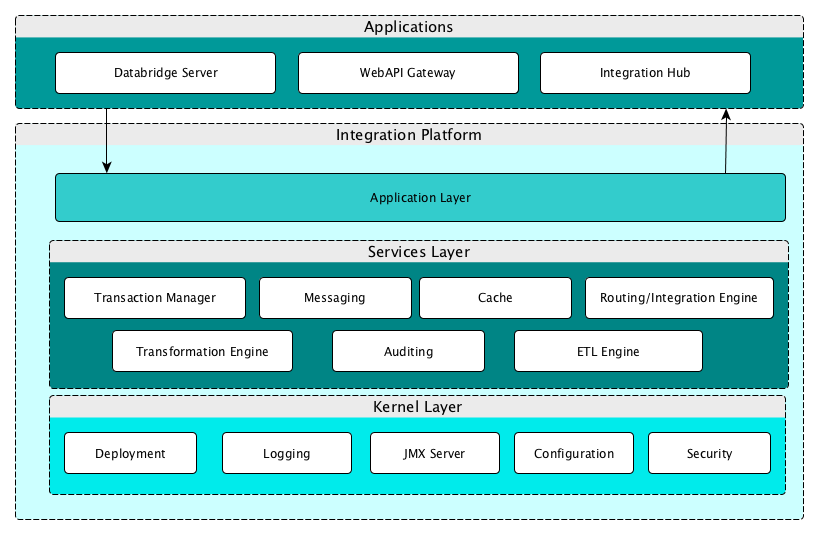

# Agora :: Nibodha's Integration Platform#
Agora provides a platform to build different integration services.

## Prerequisites ##
* JDK 1.8
* Maven 3.3

## Technology Stack ##

* Spring Framework 4.2.3.RELEASE
* Spring Boot 1.3.0.RELEASE
* Spring Batch 3.0.5.RELEASE
* Apache Camel 2.16.1
* Spring Data 1.11.1.RELEASE
* Infinispan 8.1.2
* Apache Active MQ 5.6
* HikariCP 2.4.3

## Architecture ##

 Nibodha Integration Platform(NIP) has a layered architecture that consists of
 
* Kernel Layer
* Services layer
* Application Layer 

### Kernel Layer ###

The agora kernel layer is based on Spring Boot that provides an embedded Jetty Servlet Container into which we can deploy the applications. The kernel layer provides the following features:

#### Deployment ####
The agora provides support to deploy services external to the bundled application, so the customer/deployer can decide which service is being deployed on which server.

#### Logging ####
A dynamic logging component which is based on logback and supports different APIs like SLF4J, Java Logging etc.

#### JMX Server ####
The agora uses jolokia agent to provide restful access to the MBeans, so that the any mbean client can connect to the server.

#### Configuration ####
The properties files for configuration are monitored and the changes are automatically propagated to the relevent services/applications

#### Security ####
The security framework is based on spring security.

### Services Layer ###

The agora services layer consists of embedded services which interact with the application layer to communicate with the applications built on top of the NIP. The services layer provides:

#### Transaction Manager ####

TODO: Tool choice for XA transaction manager (JBoss TS/Atomikos/Bitronix)

#### Messaging ####

The messaging service is based on Apache Active MQ which allows the developer to create JMS Message Brokers and clients and deploy them.

#### Routing/Integration engine ####

The routing/integration engine based on Apache Camel allows the developer to define routes and implement enterprise integration patterns(EIP) and deploy the routes into the camel context.
            
#### Transformation Engine ####

The transformation engine is a custom bean mapping framework.

#### Auditing ####

The auditing service logs the inbound and outbound messages to an audit log file.

#### ETL Engine ####

The ETL engine is realized using Spring Batch, and is used extract transform and load from/to different datasources.

### Application Layer ###

TODO: Add Info

## Road Map ##

TODO: Add Info

## Project Structure ##

The integration platform is a multi module maven project with the following modules

* core - provides the implementation for the services and kernel layers in the architecture layers.
* launcher - provides services to launch the integration platform
* configuration -  contains the platform configuration files

## Platform Configuration Properties List and default values ##

### MQ Configuration ###

        platform.mq.broker-url=tcp://localhost:61616
        platform.mq.data-dir=${user.home}/mq-data
        platform.mq.enabled=false
        platform.mq.password=
        platform.mq.user-name=
    
### Datasource Configuration ###
    
	    platform.jdbc.datasource.enabled=false
        platform.jdbc.datasource.names=<comma separated ds names> 
        platform.jdbc.datasource.default.cache-prep-stmts=true
        platform.jdbc.datasource.default.idle-timeout=30000

        platform.jdbc.datasource.default.max-life-time=30000
        platform.jdbc.datasource.default.maximum-pool-size=5
        platform.jdbc.datasource.default.prep-stmt-cache-size=250
        platform.jdbc.datasource.default.prep-stmt-cache-sql-limit=2048
        platform.jdbc.datasource.default.use-server-prep-stmts=true
        
        platform.jdbc.datasource.<dsname>.password=
        platform.jdbc.datasource.<dsname>.jdbc-url=
        platform.jdbc.datasource.<dsname>.user-name=
     
### Cache Configuration ###
        
        platform.cache.enabled=true
        platform.cache.config=
        

## License ##

The Nibodha's Integration Platform Agora is released under version 2.0 of the [Apache License](http://www.apache.org/licenses/LICENSE-2.0)

## FAQs ##

### 1. How to set up development environment? ###

	a. Fork the integration-platform project to the developers gitlab account.
	
	b. Clone the integration platform projects to developer's machine.
	
	c. copy the settings.xml from configuration/etc folder to the maven local repository folder usually <user.home>/.m2
	
	For windows C:\users\<username>\.m2
	For linux/mac ~/.m2

### 2. How to build and run the platform? ###
   
   Execute the following commands in terminal/command prompt
   
   Build the integration-platform
   
   `mvn clean install`
   
   Change to launcher directory
   
   `cd launcher`
   
   Start the integration platform
   
   `mvn spring-boot:run`
   
### 3. How to start the monitoring console? ###

	If the integration platform is not built, build the integration platform using maven.
	
	Change to monitoring console directory.

	`cd launcher`
	
	Start the monitoring cosole
	
	`mvn spring-boot:run`
	
	Once the monitoring console is up and running, open bowser and got to 
	http://localhost:8081, enter admin/admin to login.
	
### 4. How to add datasource? ###
	
	Change the property
	 
	  	platform.jdbc.datasource.enabled=true
	
	Add datasource names
	
		platform.jdbc.datasource.names=ds1
		
	If more than one datasource needs to be added, add comma separated ds names.
	
	Add jdbc url, user name, password properties for the datasource
	
		 platform.jdbc.datasource.ds1.jdbc-url=jdbc:oracle:thin:@localhost:1521:orcl
        platform.jdbc.datasource.ds1.user-name=scott
        platform.jdbc.datasource.ds1.password=tiger
    
   The default values are taken for the other properities mentioned, if property need to be specified for a specific datasource replace "default" with datasource name.   
			

